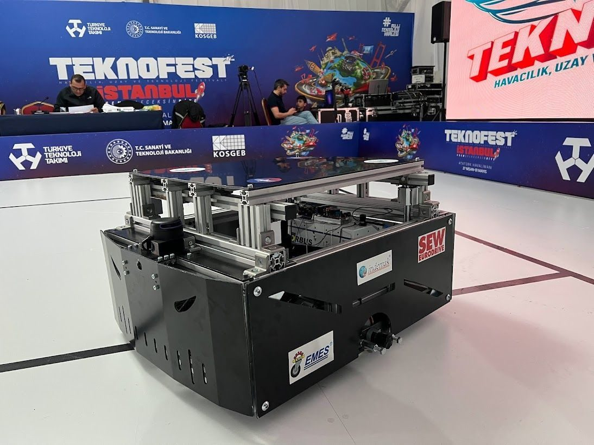
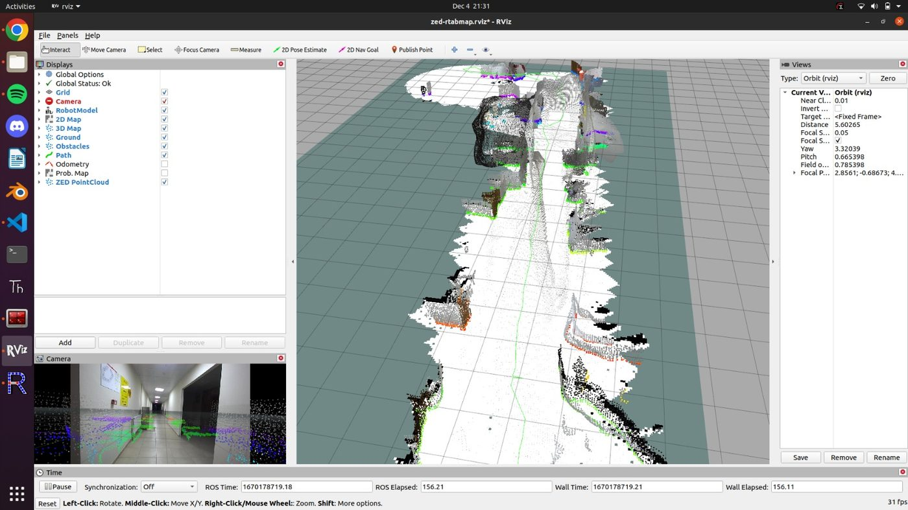
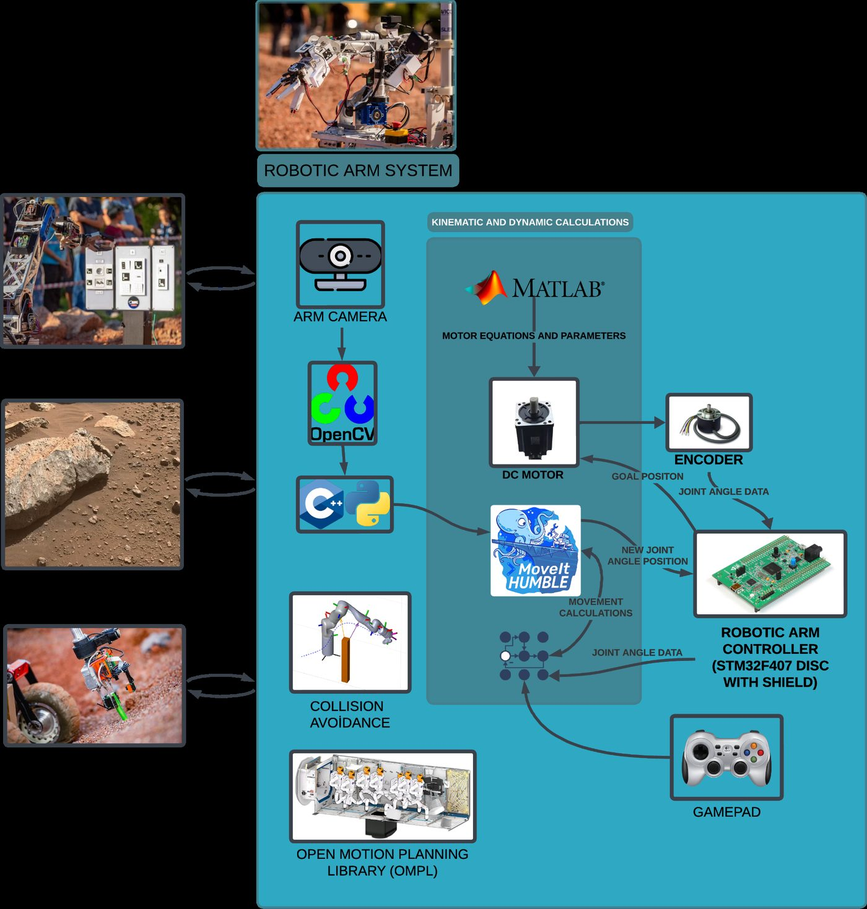
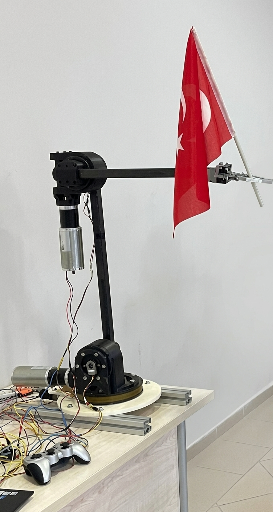
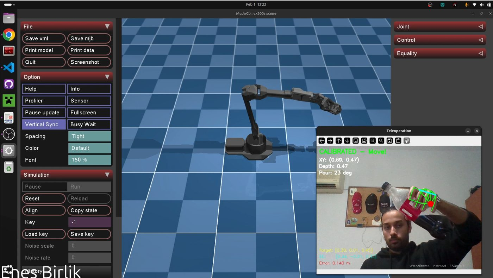
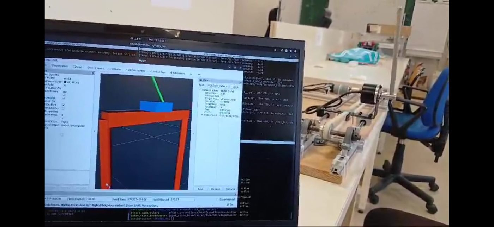
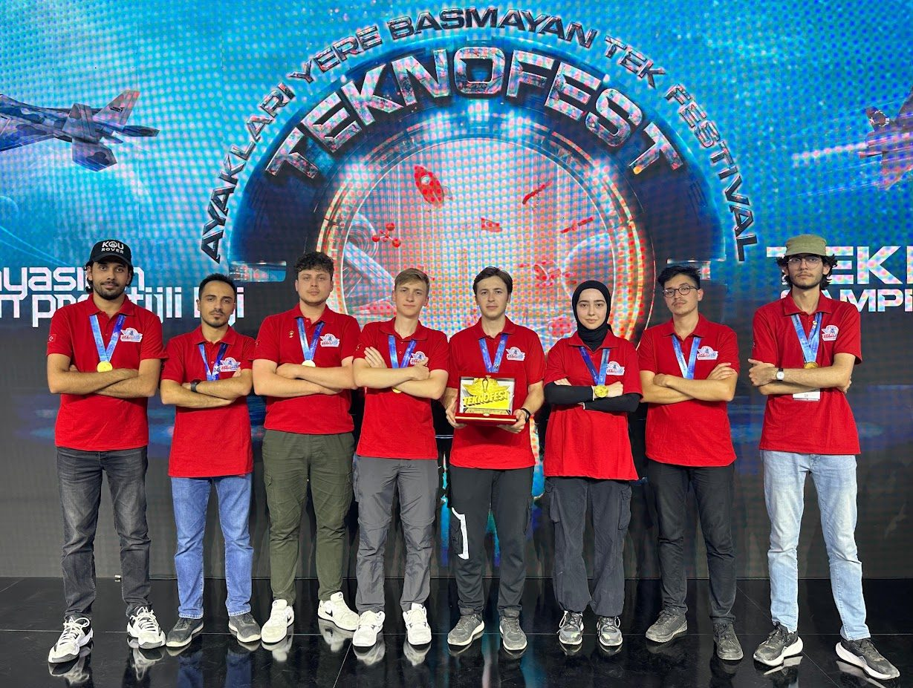

<h1 align="center">Enes Birlik</h1>

<b>Robotics Software Engineer</b> · ROS2 · Autonomous Navigation · Motion Planning

  📍 Antalya, Turkey &nbsp;·&nbsp;
  <a href="https://linkedin.com/in/enes-birlik">LinkedIn</a> &nbsp;·&nbsp;
  <a href="https://github.com/enesbirlik">GitHub</a> &nbsp;·&nbsp;
  <a href="mailto:enesbirlik0@gmail.com">enesbirlik0@gmail.com</a>

  
  
  

I build autonomous robots that work in the field, not just in simulation — localization, navigation, motion planning, and the embedded systems underneath them. Deployed Nav2, AMCL, and SLAM Toolbox on real rovers and robotic arms in C++ and Python, led a 35+ person team through the European Rover Challenge, and took 4 TEKNOFEST placements along the way, including back-to-back 1st place finishes.

---

### 🧰 Stack

  
  
  
  
  

  
  
  
  
  
  

  
  
  
  
  
  
  

---

## 🚀 Featured Projects

### Autonomous Mobile Robot Platform
*TEKNOFEST + KOU ROVER — ROS1/ROS2 full-stack autonomous navigation*

  
  &nbsp;
  

- Localization & perception pipeline fusing IMU + GPS + LiDAR + ZED2 stereo camera
- Autonomous navigation with Nav2 + AMCL; mapping via SLAM Toolbox, RTAB-Map, and RPLidar scan matching
- Lane detection and a decision state machine for autonomous mission execution
- Custom Gazebo + Blender simulation environments for pre-field validation
- Remote operation via a custom UI; hands-on field testing and electronics assembly

### Modular 6-DOF Robotic Arm — ROS2 + MoveIt2
*KOU ROVER — European Rover Challenge mission*

  
    &nbsp;
  

- Full Gazebo simulation environment with a hardware interface layer via `ros2_control`
- Inverse kinematics & motion planning with MoveIt2; joystick teleoperation over a ROS2 command layer
- Camera-based object detection and filtering for mission tasks
- Real-time digital twin visualization (RViz / MoveIt GUI) for field debugging

### Hand Tracking Robot Arm Control — MuJoCo + Computer Vision
*Personal project*

  

- Simulated the ALOHA robotic arm in MuJoCo for motion planning and control research
- Real-time hand tracking via camera-based computer vision to drive joint commands
- Mapped hand pose keypoints to joint angles — intuitive teleoperation with no physical controller

### ROS2–MATLAB Integrated Cart-Pole Control System
*Personal project*

  

- Hybrid control system for inverted pendulum stabilization, ROS2 hardware interface + actuator comms
- Implemented and compared PID, LQR, and Fuzzy controllers in both MATLAB and Python
- Real-time closed-loop ROS2 ↔ MATLAB interoperability

---

## 🧭 Journey

- 🛠️ **Software Engineer Intern**, STM — Jul–Aug 2025
- 🧑‍🤝‍🧑 **Team Leader (General Lead)**, KOU ROVER — Oct 2024–Jun 2025
- 🛠️ **Software Engineer Intern**, MARS Autonomous Mobile Robots — Jul–Aug 2024
- 💻 **Software Team Lead**, KOU ROVER — Sep 2023–Oct 2024
- 🤝 **Team Member**, KOU ROVER — Oct 2021–Sep 2023
- 🎓 B.S. Mechatronics Engineering, Kocaeli University (2020–2025)

---

## 🏆 Awards & Research

  

- **TEKNOFEST** — Digital Technologies in Industry: 🥇 1st (2024) · 🥇 1st (2025, as mentor) · 🥉 3rd (2022) · 6th (2023)
- **European Rover Challenge (ERC)** — International participant, KOU ROVER team
- **TÜBİTAK 2209-A** — Humanoid Robot Development (project team member)
- **TÜBİTAK 2209-A** — 6-DOF Robotic Arm Development (project team member)

---

## 📊 GitHub Stats

---

  
  
  

<i>Building robots that perceive, decide, and move — on real hardware, not just in simulation.</i>

